# Skill connections

How the skills in [`skills/`](../skills) fit together: which ones call which, which ones nest inside
another's session, and which sequences they run in.

The set is **composable, not a fixed pipeline**. [`next`](./next.md) picks the earliest unresolved
gate rather than the next item on a checklist, so any skill can be an entry point. What follows are
the paths that actually get walked.

## Four kinds of connection

Every edge in this document is one of four kinds. Read the arrows with these in mind.

| Kind | Meaning | Example |
| --- | --- | --- |
| **Routes to** | One session ends, another begins — usually a fresh context | `/to-tickets` → `/implement` |
| **Runs inside** | Nested in the caller's session; owns no transition and records nothing of its own | `/implement` → `/tdd` |
| **Publishes to** | Leaves a durable evidence comment that a later session reads back | `/code-review` → the ticket |
| **Reads config from** | Depends on files another skill wrote | `/next` → `/setup-git-loopy-skills` |

One skill is a hub. [`next`](./next.md) is the **router** — it reads live state (tracker, branch,
diff, worktrees) and names one action. It does no work itself.

Eleven skills leave a durable evidence comment on the ticket they acted on and name the skill that
succeeds them: `code-review`, `grill-with-docs`, `implement`, `prototype`, `push`,
`research`, `resolving-merge-conflicts`, `to-spec`, `to-tickets`, `triage`, `wayfinder`.

## The connection map

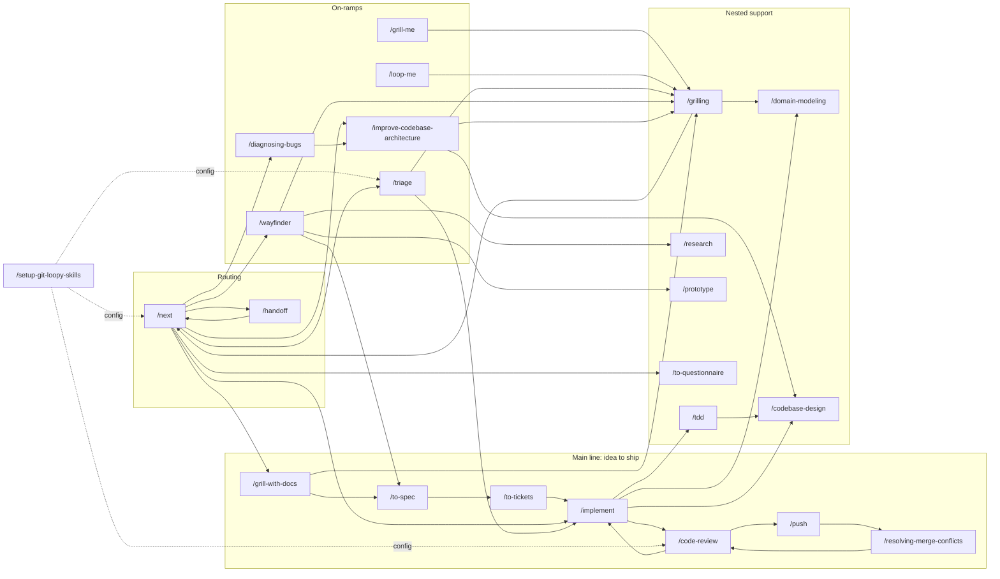

Solid arrows route or nest; dotted arrows publish or read config.

---

## 1. The main line: idea to ship

The spine of the set. Grill → spec → tickets stays in **one unbroken context**; each `/implement`
ticket starts in a **fresh one**.

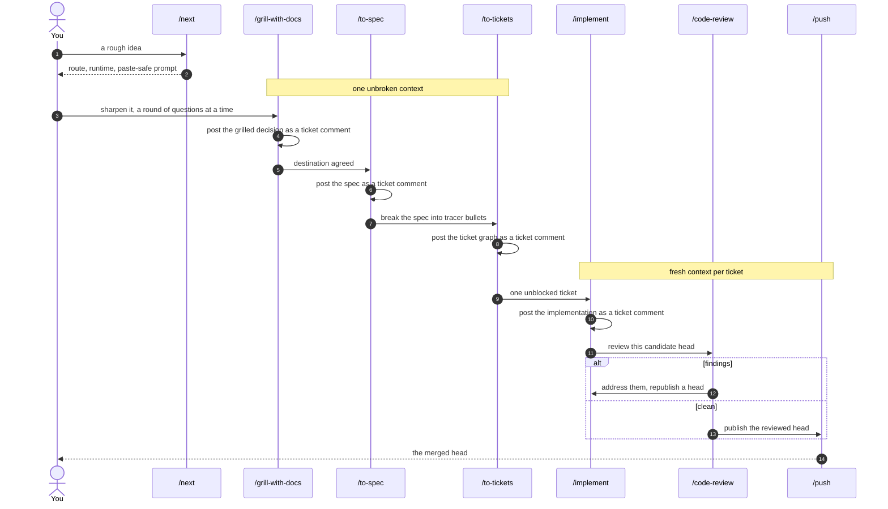

A genuinely small change may skip the middle and go straight from grilling to
[`implement`](./implement.md).

## 2. Routing and session continuity

[`next`](./next.md) decides *what*; [`handoff`](./handoff.md) *launches* it.

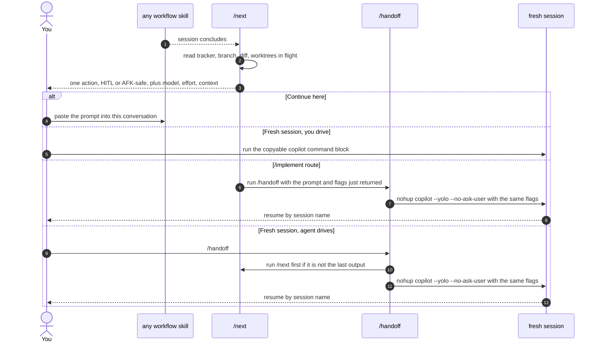

`/next` also routes to `/compact` at an intentional phase break, and to `/handoff` when the thread
must branch or survive.

## 3. The grilling family

[`grilling`](./grilling.md) is the interview engine. Four skills wrap it for different subjects; all
of them work a **design tree** in rounds until the frontier is empty.

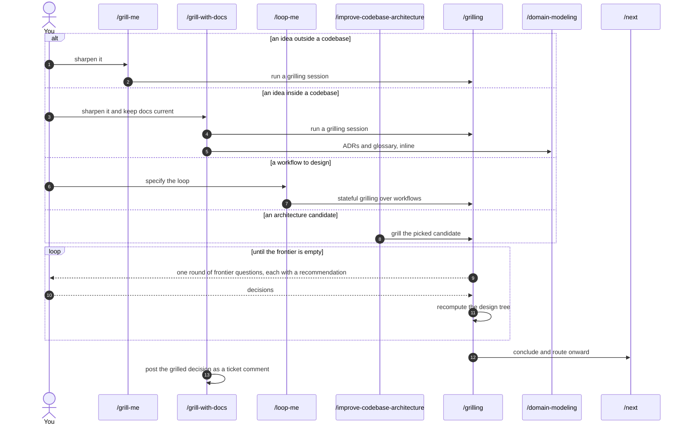

`/batch-grill-me` is a standalone variant of the same discipline — it asks the whole frontier at
once instead of one question at a time, and calls nothing else. `/grill-with-docs` is the only
member that leaves a ticket comment; a grilling nested inside `/triage` or `/wayfinder` records
nothing of its own.

## 4. Wayfinder: planning beyond one context

For work too large for a single planning session. [`wayfinder`](./wayfinder.md) charts decision
tickets on the tracker and resolves them one at a time, delegating each to the right skill.

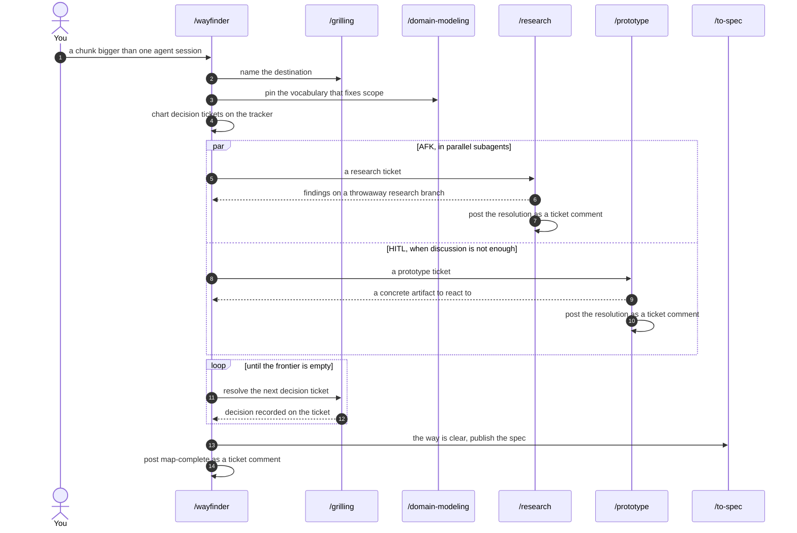

Wayfinder routes to [`to-spec`](./to-spec.md), **not** straight to implementation — unless the
effort proved genuinely small.

## 5. Triage: work you did not create

The on-ramp for inbound issues and external PRs. [`triage`](./triage.md) is a state machine of
roles that ends with either an agent-ready brief or a request for missing information.

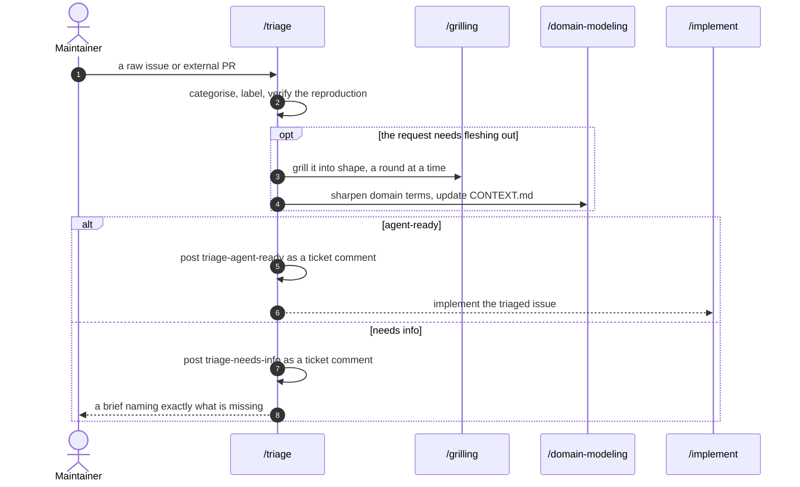

`/to-tickets` output is already agent-ready — reserve `/triage` for work that arrived raw.

## 6. Inside `/implement`

Four skills run **nested** here. They hand their evidence back to `/implement` and record nothing
of their own, so the whole ticket is one durable transition.

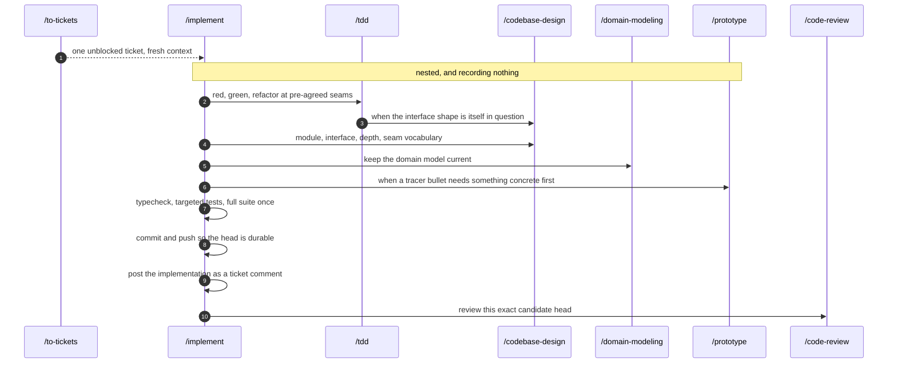

Never review an uncommitted worktree — `/implement` pushes first so the head a reviewer reads is the
head that was built.

## 7. Review, publish, reconcile

Review is a **two-axis** check run in parallel sub-agents: Standards and Spec. Remediation returns
to review by construction.

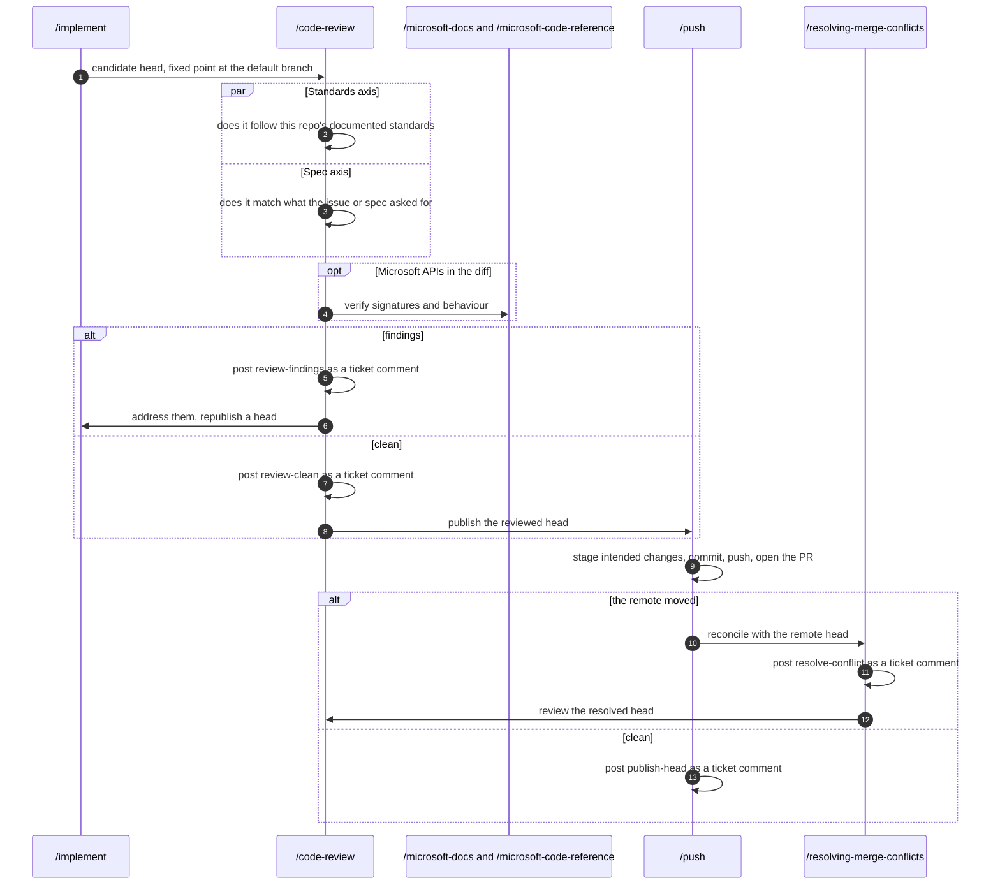

`/resolving-merge-conflicts` always routes back through `/code-review` — a resolved head is a new
candidate, not a reviewed one.

## 8. Codebase health

Two survey skills that feed the main line rather than sitting in it. Neither implements anything.

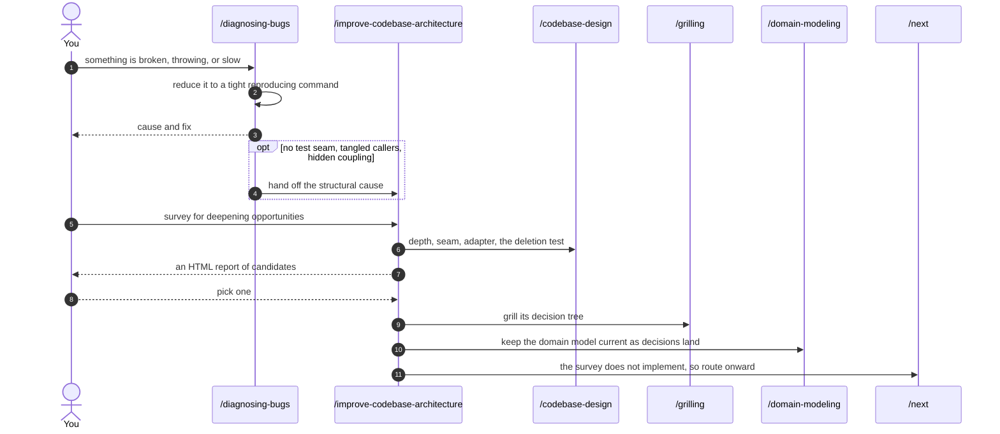

A candidate picked here becomes an *idea* for [`grill-with-docs`](./grill-with-docs.md).

## 9. Bootstrap

[`setup-git-loopy-skills`](./setup-git-loopy-skills.md) runs **once per repo**, before anything else. It
writes the config that four other skills read.

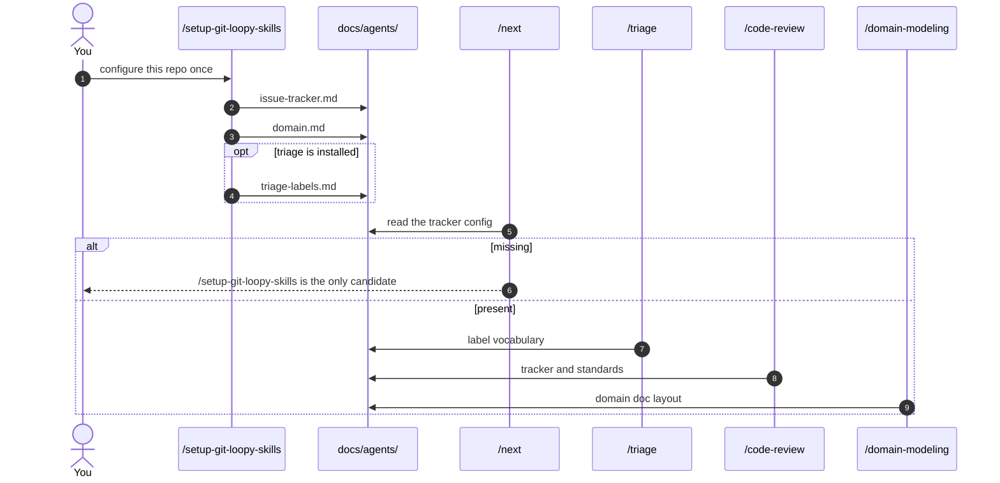

## 10. Writing for agents, and the Microsoft cluster

Two small chains that sit off to the side of the engineering flow.

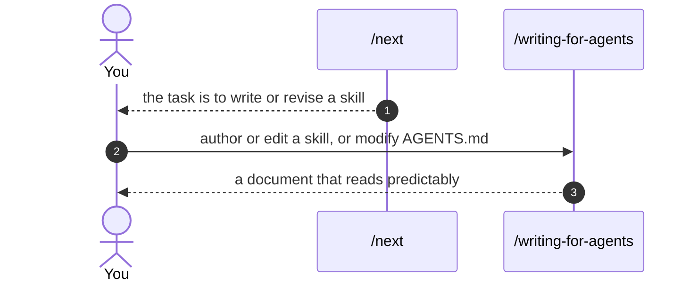

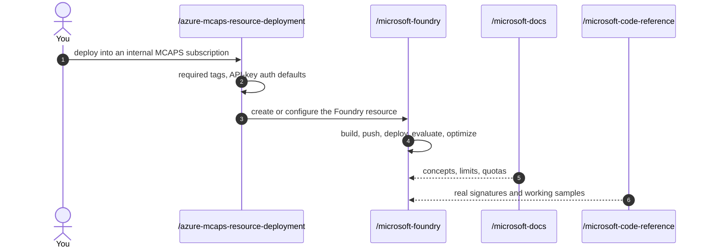

`/microsoft-docs` and `/microsoft-code-reference` are also pulled in by
[`code-review`](./code-review.md) whenever a diff touches Microsoft technologies.

---

## Standalone skills

These have no workflow edges. Reach for them directly; they neither route onward nor publish.

| Skill | What it stands alone for |
| --- | --- |
| `/batch-grill-me` | Grilling, whole frontier per round instead of one question at a time |
| `/codebase-audit` | Line-by-line pre-push sweep for junk, dead code, and security holes |
| `/create-readme` | Write a project README |
| `/mermaid-diagrams` | Author diagrams in Mermaid |
| `/playwright-cli` | Drive a browser for testing, screenshots, and extraction |
| [`/teach`](./teach.md) | A stateful, multi-session learning workspace |
| [`/to-questionnaire`](./to-questionnaire.md) | Turn a decision only another person can answer into a document to send |
| [`/wait-what`](./wait-what.md) | Re-pitch the last message when it did not land |
| `/wizard` | Generate a bash wizard for steps only a human can perform |

`/to-questionnaire` is the one exception: `/next` routes *to* it, and its answer comes back into
`/grill-with-docs` or `/to-spec`.

## Full edge reference

| From | To | Kind | When |
| --- | --- | --- | --- |
| `next` | 22 routes | routes to | The earliest unresolved gate decides which |
| `next` | `handoff` | runs | The chosen route is `/implement` |
| `next` | `setup-git-loopy-skills` | reads config from | `docs/agents/issue-tracker.md` is missing |
| `handoff` | `next` | routes to | Runs `/next` first if it is not the last output |
| `handoff` | fresh session | routes to | Launches the sized runtime in the background |
| `grilling` | `next` | routes to | At the conclusion of every grilling session |
| `grill-me` | `grilling` | runs inside | Always — it is a one-line wrapper |
| `loop-me` | `grilling` | runs inside | Stateful grilling over workflow specs |
| `grill-with-docs` | `grilling`, `domain-modeling` | runs inside | Always |
| `grill-with-docs` | the ticket | publishes to | On the grilled decision |
| `improve-codebase-architecture` | `codebase-design` | runs inside | For the architecture vocabulary |
| `improve-codebase-architecture` | `grilling`, `domain-modeling` | runs inside | Once a candidate is picked |
| `improve-codebase-architecture` | `next` | routes to | The survey never implements |
| `diagnosing-bugs` | `improve-codebase-architecture` | routes to | The bug exposed a structural cause |
| `wayfinder` | `grilling`, `domain-modeling` | runs inside | Naming the destination, resolving tickets |
| `wayfinder` | `research` | runs inside | A fact-shaped ticket, resolved AFK in parallel |
| `wayfinder` | `prototype` | runs inside | A ticket needing something concrete |
| `wayfinder` | `to-spec` | routes to | The frontier is empty and the way is clear |
| `triage` | `grilling`, `domain-modeling` | runs inside | The request needs fleshing out |
| `triage` | `implement` | routes to | The issue reaches agent-ready |
| `to-spec` | `to-tickets` | routes to | The spec is published |
| `to-tickets` | `implement` | routes to | One unblocked ticket, fresh context each |
| `implement` | `tdd` | runs inside | At pre-agreed seams |
| `implement` | `codebase-design`, `domain-modeling` | runs inside | Shape or vocabulary questions mid-build |
| `implement` | `prototype` | runs inside | A tracer bullet needs a concrete answer |
| `implement` | `code-review` | routes to | The candidate head is committed and pushed |
| `tdd` | `codebase-design` | runs inside | The interface shape is itself in question |
| `code-review` | `implement` | routes to | Review found defects |
| `code-review` | `push` | routes to | Review came back clean |
| `code-review` | `microsoft-docs`, `microsoft-code-reference` | runs inside | The diff touches Microsoft technologies |
| `push` | `resolving-merge-conflicts` | routes to | The remote head moved |
| `resolving-merge-conflicts` | `code-review` | routes to | A resolved head is a new candidate |
| `setup-git-loopy-skills` | `triage`, `domain-modeling` | reads config from | Writes the labels and domain layout they use |
| `azure-mcaps-resource-deployment` | `microsoft-foundry` | routes to | Creating or configuring a Foundry resource |
| eleven producers | the ticket | publishes to | On completing a transition they own |

## Rules that govern the edges

- **Context boundaries.** `/grill-with-docs` → `/to-spec` → `/to-tickets` stays in one context.
  Every `/implement` ticket starts in a fresh one.
- **Nesting owns nothing.** A skill running inside another's session hands its evidence back and
  records no transition of its own.
- **Reviews come back.** `/code-review` findings return to `/implement`, which republishes a head
  and re-enters review. `/resolving-merge-conflicts` re-enters review too.
- **Surveys do not build.** `/improve-codebase-architecture` and `/diagnosing-bugs` produce ideas
  and causes; they route onward rather than implementing.
- **Detours are bridged.** A `/prototype` or `/research` detour out of a live thread is bridged with
  `/handoff` in both directions when the original thread must survive.
- **Direct reach is narrow.** Reach for `/domain-modeling`, `/codebase-design`, or `/tdd` directly
  only when the vocabulary, module shape, or a single behaviour is itself the unresolved gate.

## See also

- [`next`](./next.md) — the router that picks the edge to walk
- [`setup-git-loopy-skills`](./setup-git-loopy-skills.md) — the config every workflow edge depends on
