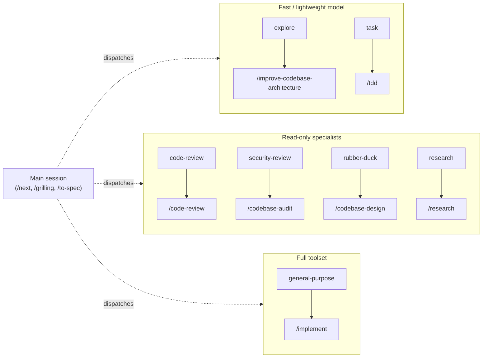

# Skill → subagent map

Which skill in [`skills/`](../../skills) belongs in which **built-in GitHub Copilot CLI subagent**.

A skill is *what* to do. A subagent is *where* it runs — its own context window, its own toolset,
its own model. Pairing them wrong is the common failure: a two-hour build handed to a fast
exploration agent, or a five-file lookup handed to a full-capability agent that costs ten times as
much to reach the same answer.

The CLI ships seven subagents. Each one below gets exactly one **primary** skill — the skill it was
effectively designed to carry — plus the skills that ride along inside it.

## The seven, at a glance

| Subagent | `agent_type` | Slash entry | Primary skill | Why it's the fit |
| --- | --- | --- | --- | --- |
| Explore | `explore` | — | `/improve-codebase-architecture` | The skill already says to walk the codebase with an Explore agent |
| Task | `task` | — | `/tdd` | Brief on success, full output on failure — exactly a red/green verdict |
| General-purpose | `general-purpose` | `/delegate` | `/implement` | A whole ticket, full toolset, fresh window — but see the caveat below when `/next` spawns it |
| Rubber duck | `rubber-duck` | `/rubber-duck` | `/codebase-design` | Design-it-twice needs an independent critic to compare the drafts |
| Code review | `code-review` | `/review` | `/code-review` | 1:1 — the skill's two axes are two of these agents |
| Research | `research` | `/research` | `/research` | 1:1 — the skill opens by saying "spin up a background agent" |
| Security review | `security-review` | `/security-review` | `/codebase-audit` | The audit's secrets-and-holes pass, read-only and high-confidence |

## Explore — `/improve-codebase-architecture`

Fast, lightweight, read-only. Made for several independent research threads that each need their
own context.

`/improve-codebase-architecture` names this agent outright: *"use the Agent tool with
`subagent_type=Explore` to walk the codebase"*, noting friction points organically rather than by
rigid heuristic. That is what Explore is good at — broad, cheap, unstructured reading.

**Also rides here:** the fact-finding half of `/grilling` and `/batch-grill-me` (both say to
dispatch a sub-agent for any frontier question answerable from the environment), and the
codebase-orientation phase of `/diagnosing-bugs` and `/domain-modeling`.

**Don't** use it for a single continuous chain of "find the symbol, read the file, edit it" — that
is faster done directly.

## Task — `/tdd`

Runs verbose commands and reports the verdict: a one-line summary on success, the full stack trace
on failure. It keeps build and test noise out of the parent context.

`/tdd` is the tightest fit in the set. Every red/green step is a pass/fail question, and the one
time you need the whole output is the failing run — where TDD demands you read the message and
confirm the test failed for the *right* reason.

**Also rides here:** the feedback loop in `/diagnosing-bugs` phase 1 (build a loop, then run it a
hundred times), `/playwright-cli` browser runs, `/microsoft-foundry` deploy and eval commands, and
the `az` verification commands in `/az-mcaps-resource-deployment`.

## General-purpose — `/implement`

The full toolset on a high-capability model, in a separate context window. Use it when the work is
genuinely multi-step and you want your own conversation to stay clean.

`/implement` is the canonical passenger — take a spec or a ticket and build it, tests and review
pass included. `/handoff` exists specifically to launch it this way: it takes the prompt and sized
runtime that `/next` produced and fires it as a background agent.

**Also rides here:** `/prototype` (throwaway by definition, so a disposable context suits it),
`/wizard`, `/create-readme`, and per-issue `/triage` once a human has settled the category.

**Caveat — the `/next` chain cannot use this agent.** `general-purpose` emits no `subagentStart` or
`subagentStop` hook event. The chain described in
[ADR-0001](../adr/0001-in-session-subagents-for-the-next-loop.md) triggers the next `/next` from
`subagentStop`, so a route spawned as `general-purpose` would finish silently and stall the chain
after one hop. When `/next` spawns `/implement` it uses a **custom YAML agent** instead, which does
emit. Reach for `general-purpose` when you are delegating `/implement` by hand.

## Rubber duck — `/codebase-design`

An independent critic of plans and implementations. It reports bugs, logic errors, and design
flaws, and stays silent on style.

`/codebase-design` carries the design-it-twice pattern: draft the interface several radically
different ways, then compare on depth, locality, and seam placement. Drafting is general-purpose
work; **judging** is the duck. Ask it which draft is deeper and it will tell you what each one
leaks.

**Also rides here:** a second opinion on a `/wayfinder` map before you commit to the tickets, and a
sanity pass over the plan `/next` recommends when the recommendation surprises you.

## Code review — `/code-review`

A 1:1 pairing. The skill reviews a diff against a fixed point along two axes — **Standards** and
**Spec** — and it already specifies that they run as parallel sub-agents so neither pollutes the
other's context. The built-in `code-review` agent is the carrier for each axis.

Two constraints come from the skill, not the agent: pin and verify the fixed point *before*
dispatching (a bad ref or empty diff should fail in the main session, not inside two agents), and
never merge the two axes into one verdict.

## Research — `/research`

Another 1:1. The skill's first line is "spin up a background agent to do the research, so you keep
working while it reads" — that agent is this one. It searches repos, fetches files, verifies
claims, and reports with citations, which is what the skill demands: primary sources only, every
claim traced back to whoever owns it.

**Also rides here:** `/microsoft-docs` and `/microsoft-code-reference`, which the research skill
tells you to reach for on anything Microsoft, and the parallel research tickets `/wayfinder`
fires off to unblock its decisions.

Launch it in **background** mode. It is the one subagent where you reliably have real work to do
while it runs.

## Security review — `/codebase-audit`

Read-only, high-confidence findings only. The CLI's rule is that you invoke this specialist
*before* investigating a security question yourself, not after.

`/codebase-audit` is the pre-push sweep: committed `.env` files, hardcoded keys and tokens, `*.pem`
and `credentials.json`, and the security holes it marks as CRITICAL BLOCKERs. That detection pass
is exactly this agent's scope.

The split to respect: `security-review` finds, the main session fixes. The audit skill also deletes
junk files and rewrites code, and the agent cannot — so run the agent for the verdict, then apply
the fixes yourself.

## Skills that must not be delegated

Not everything belongs in a subagent. A subagent starts with a fresh context and cannot talk to the
user, which rules out two whole families.

**Human-in-the-loop.** `/grilling`, `/grill-me`, `/batch-grill-me`, `/grill-with-docs`, `/loop-me`,
`/teach`, `/to-questionnaire`, `/skill-router`, `/triage` in its interactive roles. Each works in
rounds of question and answer; the decisions are the user's. Delegate the fact-finding *inside*
them, never the interview.

**Context-bound.** `/to-spec` and `/to-tickets` synthesise *this* conversation — hand them a fresh
window and there is nothing to synthesise. `/unslop` applies to your own prose as you write it.
`/wait-what` re-pitches the message that just failed to land. `/next` reads live state and must put
its answer in front of you.

**Side-effecting or state-bound.** `/setup-git-loopy-skills` configures the repo once.

`/push` and `/resolving-merge-conflicts` were listed here too, on the grounds that they act on the
working tree and want a human on the approval. That ban is **lifted** for the `/next` chain, which
may spawn both — see [ADR-0001](../adr/0001-in-session-subagents-for-the-next-loop.md). The chain
spawns a route only when it is marked **AFK-safe**, meaning the target is fully specified and needs
no further judgment, which is a narrower guarantee than refusing every publication outright.
Delegating either one *outside* that gate is still wrong.

Reference skills — `/mermaid-diagrams`, `/writing-for-agents`, `/domain-modeling`'s vocabulary —
are read into whatever session needs them rather than dispatched anywhere.

## Full index

| Skill | Subagent | Mode |
| --- | --- | --- |
| `/az-mcaps-resource-deployment` | `task` | Verification commands only |
| `/batch-grill-me` | — (`explore` for facts) | Main session |
| `/code-review` | `code-review` | Two in parallel, one per axis |
| `/codebase-audit` | `security-review` | Detect in agent, fix in main |
| `/codebase-design` | `rubber-duck` | Parallel drafts, one critic |
| `/create-readme` | `general-purpose` | Sync |
| `/diagnosing-bugs` | `task` (+ `explore`) | Loop in agent, hypotheses in main |
| `/domain-modeling` | — (`explore` to harvest terms) | Main session |
| `/grill-me`, `/grill-with-docs`, `/grilling` | — (`explore`, `research` for facts) | Main session |
| `/handoff` | `general-purpose` | Background — it is the launcher |
| `/implement` | `general-purpose`, or a custom agent when spawned by the `/next` chain | Background |
| `/improve-codebase-architecture` | `explore` | Parallel threads |
| `/loop-me` | — | Main session |
| `/mermaid-diagrams` | — | Reference |
| `/microsoft-code-reference` | `research` | Sync |
| `/microsoft-docs` | `research` | Sync |
| `/microsoft-foundry` | `task` | Deploy and eval runs |
| `/next` | — | Main session |
| `/playwright-cli` | `task` | Sync |
| `/prototype` | `general-purpose` | Background |
| `/push` | custom agent, via the `/next` chain only | Background when AFK-safe, else main session |
| `/research` | `research` | Background |
| `/resolving-merge-conflicts` | custom agent, via the `/next` chain only | Background when AFK-safe, else main session |
| `/setup-git-loopy-skills` | — | Main session |
| `/skill-router` | — | Main session |
| `/tdd` | `task` | Sync, per red/green step |
| `/teach` | — | Main session |
| `/to-questionnaire` | — | Main session |
| `/to-spec` | — | Main session |
| `/to-tickets` | — | Main session |
| `/triage` | `general-purpose` per issue | Interactive roles stay in main |
| `/unslop` | — | Always, in whatever session writes |
| `/wait-what` | — | Main session |
| `/wayfinder` | — (fires `research` in parallel) | Main session |
| `/wizard` | `general-purpose` | Sync |
| `/writing-for-agents` | — | Reference |

## Picking the mode

**Sync** is the default. Use **background** only when you have real, independent work to do while
the agent runs — `/research` while you keep building, `/implement` via `/handoff` while you plan
the next ticket. Launching in background and then polling for the result is slower than sync.

Model and effort per subagent come from your `/subagents` configuration, not from this document.
Leave them alone unless a specific run needs an override.

## Where this fits

[`skill-connections.md`](../skill-connections.md) maps how skills hand off to each other.
This document maps where each one **runs**. Read them together: the connection map gives you the
sequence, this one gives you the window.
